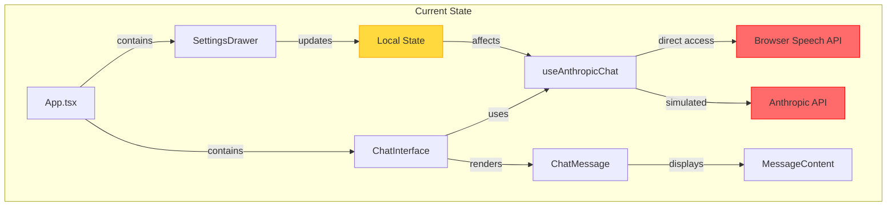
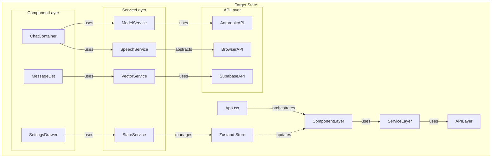
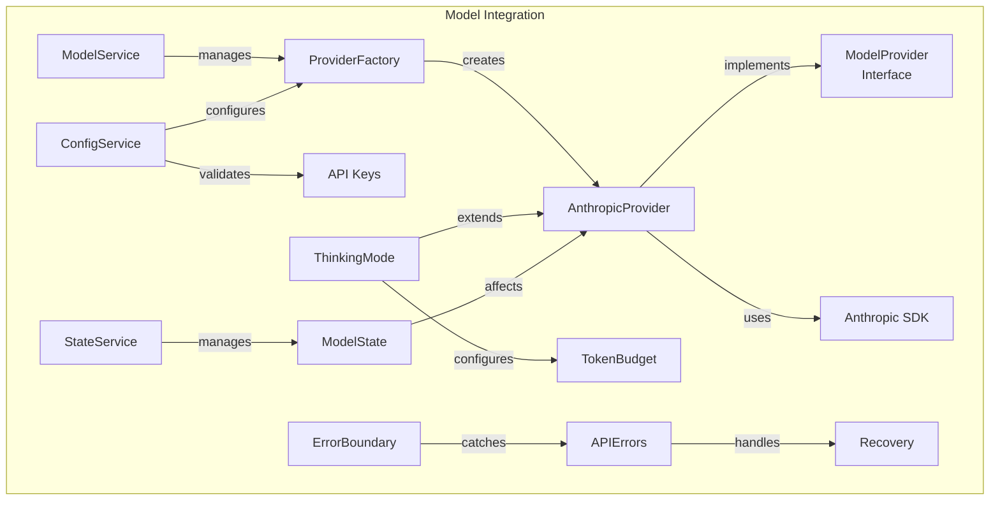
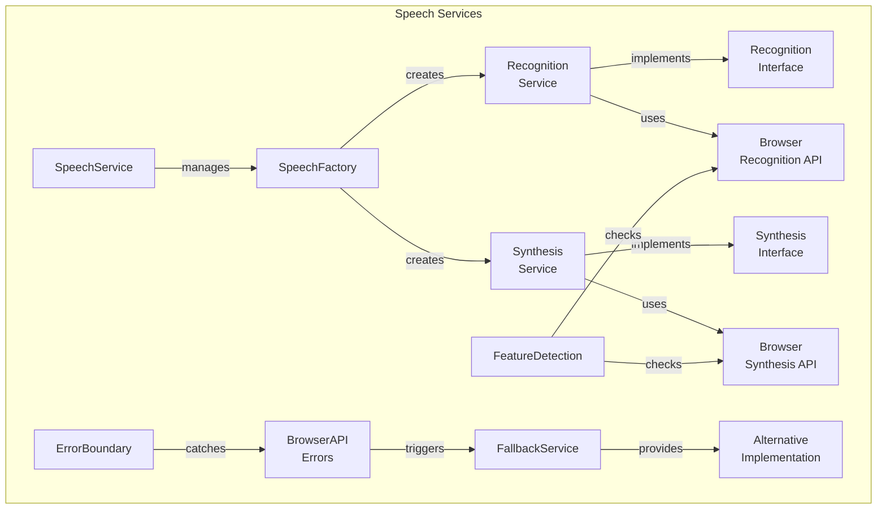

```mermaid
graph TD
    %% Migration Path
    subgraph "Implementation Sequence"
        %% Phase 1
        A4["Current State"] -->|P0| B4["API Integration"]
        B4 -->|P0| C4["Speech Services"]
        C4 -->|P0| D4["Error Handling"]
        
        %% Phase 2
        D4 -->|P1| E4["State Management"]
        E4 -->|P1| F4["Service Layer"]
        
        %% Phase 3
        F4 -->|P1| G4["Component Isolation"]
        G4 -->|P2| H4["Feature Implementation"]
        
        %% Phase 4
        H4 -->|P2| I4["Optimization"]
        I4 -->|P2| J4["Target State"]
        
        %% Risk Levels
        style B4 fill:#ff6b6b,stroke:#ff0000
        style C4 fill:#ff6b6b,stroke:#ff0000
        style E4 fill:#ffd93d,stroke:#ffa500
        style F4 fill:#ffd93d,stroke:#ffa500
        style I4 fill:#87ff87,stroke:#00ff00
    end