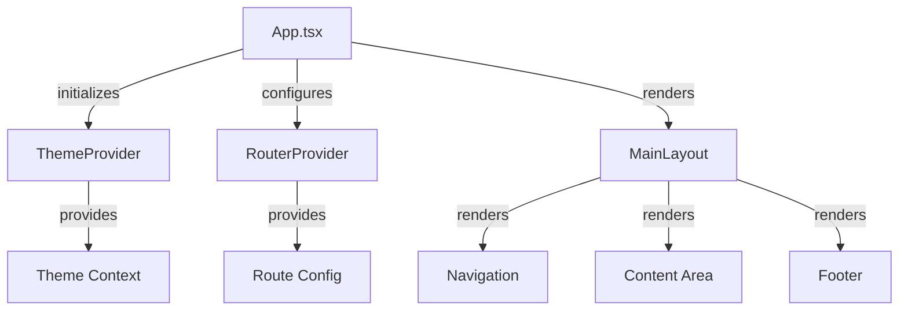

# Entry Point Surgery Plan

## App.tsx Analysis

### Current State
- Primary routing and initialization hub
- Handles global state setup
- Manages theme configuration
- Renders core layout structure

### Responsibilities
1. Application bootstrapping
2. Route configuration
3. Theme management
4. Layout orchestration
5. Global state initialization
6. Error boundary setup

### Extraction Candidates

#### 1. Theme Provider
- **Current Location**: Embedded in App.tsx
- **Target Module**: `src/providers/ThemeProvider.tsx`
- **Pattern**: Context Provider
- **Dependencies**: TailwindCSS configuration
- **Difficulty**: 2/5
- **Risk**: 30%
- **Rollback**: Git revert + feature flag

#### 2. Route Configuration
- **Current Location**: Inline routes in App.tsx
- **Target Module**: `src/routes/index.tsx`
- **Pattern**: Configuration Object
- **Dependencies**: Page components
- **Difficulty**: 1/5
- **Risk**: 20%
- **Rollback**: Maintain old routing temporarily

#### 3. Layout Container
- **Current Location**: Mixed with App.tsx
- **Target Module**: `src/layouts/MainLayout.tsx`
- **Pattern**: Component Composition
- **Dependencies**: UI components
- **Difficulty**: 2/5
- **Risk**: 40%
- **Rollback**: Feature flag toggle

### Breaking Changes
1. Theme context access points
2. Route import paths
3. Layout component props

### Post-Surgery Architecture

### Success Metrics
- Reduce App.tsx to < 100 lines
- Clear single responsibility per file
- Improved test coverage potential
- Easier component updates
- Reduced merge conflicts

## main.tsx Analysis

### Current State
- Minimal React initialization
- Root element mounting
- Basic error handling

### Recommendation
- Current implementation is appropriately sized
- No immediate surgery needed
- Consider adding error boundary wrapper

## Implementation Strategy

### Phase 1: Preparation
- Create new directories for providers and layouts
- Add feature flags for gradual rollout
- Set up test infrastructure

### Phase 2: Extraction
1. Theme Provider
2. Route Configuration
3. Layout Components

### Phase 3: Integration
- Update imports across codebase
- Migrate context consumers
- Update test suites

### Phase 4: Cleanup
- Remove old code
- Update documentation
- Verify all features working

### Rollback Plan
- Feature flags for each extraction
- Git revert points after each phase
- Parallel old/new code running capability