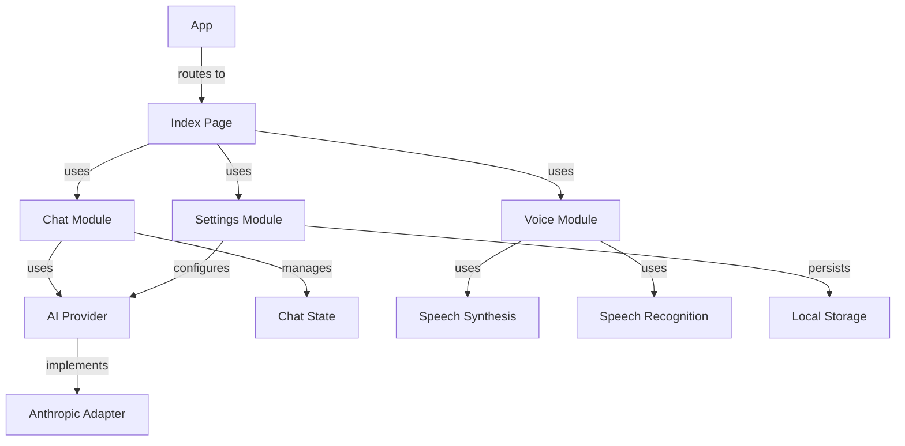

# Fresh Eyes Analysis

## Core Architecture

The codebase implements a React-based AI chat interface with voice capabilities, following a modular architecture pattern:

### Entry Points
- [`App.tsx`](humanityzero/src/App.tsx) serves as a lean router and provider setup
- [`Index.tsx`](humanityzero/src/pages/Index.tsx) implements the main chat interface

### Module Structure
- `/ai-provider`: Provider abstraction layer
  - Clean adapter pattern implementation for Anthropic
  - Extensible interface for additional providers
  - Streaming support with proper error handling

- `/chat`: Core chat functionality
  - Separation of state management and UI components
  - Clean hook composition pattern in useChatWithAI
  - Markdown rendering for messages

- `/voice`: Speech integration
  - Modular speech synthesis service
  - Microphone input handling
  - Text processing utilities

- `/settings`: Configuration management
  - Persistent storage abstraction
  - Settings UI components
  - Type-safe config handling

## Key Patterns

1. **Provider Abstraction**
   - Strong interface boundaries in AIProvider
   - Proper error handling and API key validation
   - Stream processing for real-time responses

2. **State Management**
   - Hooks-based composition
   - Clear separation of concerns
   - Predictable data flow

3. **Component Architecture**
   - Modular UI components
   - Consistent prop interfaces
   - Reusable base components

## Initial Findings

### Strengths
1. Clean module boundaries
2. Strong typing throughout
3. Proper error handling
4. Streaming support implementation
5. Voice integration architecture

### Areas for Investigation
1. Chat state management coupling
2. Provider interface extensibility
3. Voice service integration points
4. Settings persistence strategy
5. Component reuse patterns

## Next Steps

1. Deep dive into provider implementations
2. Map component dependencies
3. Analyze state management patterns
4. Document voice integration points
5. Review settings persistence

## Architecture Diagram

## Initial Metrics

### File Counts
- Core Components: 3
- Modules: 4
- Utility Files: 5
- UI Components: 30+

### Complexity Assessment
- Entry Points: Low
- Provider Layer: Medium
- Chat Logic: Medium
- Voice Integration: Medium
- Settings Management: Low

This analysis represents the initial scan of the codebase. Further investigation will focus on specific areas identified for deeper analysis.