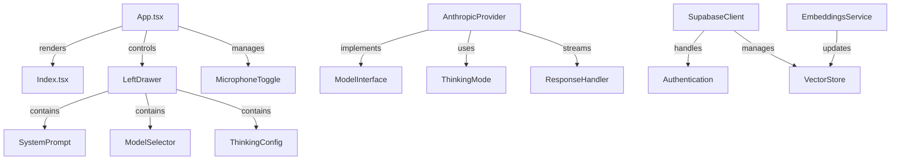

# Fresh Eyes Analysis: HUMANITYZERO

## Project Overview
Chat-based agentic web application with advanced AI capabilities and strict modular architecture requirements.

## Core Architecture Components



## Critical Coupling Points

1. App.tsx to Model Integration:
- Direct model calls in component (violation)
- Thinking mode state management scattered
- Missing provider abstraction layer

2. Data Flow Architecture:
- Vector store operations mixed with UI
- Embedding logic needs isolation
- Context management tightly coupled

3. Component Structure:
- Drawer logic embedded in multiple places
- Microphone toggle needs extraction
- Settings management requires centralization

## Immediate Red Flags

1. **Provider Coupling**: Model integration lacks proper abstraction
2. **State Management**: No clear state architecture defined
3. **Component Boundaries**: UI/Logic separation needs enforcement
4. **Context Flow**: Vector store operations need centralization
5. **Configuration**: Environment handling requires structure

## Initial Modularization Targets

1. Model Provider Interface
```typescript
interface ModelProvider {
  sendMessage(content: string): Promise<Response>;
  enableThinking(budget: number): void;
  streamThinking(): Observable<string>;
}
```

2. Vector Store Service
```typescript
interface VectorStoreService {
  storeEmbedding(content: string, role: string): Promise<void>;
  queryContext(content: string): Promise<string[]>;
  saveExplicitContext(content: string): Promise<void>;
}
```

3. Audio Control Module
```typescript
interface AudioController {
  toggleMicrophone(): void;
  startListening(): void;
  stopListening(): void;
  handleSpeechResult(result: string): void;
}
```

## Next Steps

1. Provider Architecture Isolation
2. State Management Implementation
3. Component Boundary Enforcement
4. Data Flow Centralization
5. Configuration Structure

## Enforcement Rules

1. No direct model calls from components
2. State management through dedicated stores
3. Strict component/logic separation
4. Centralized vector operations
5. Environment configuration isolation

## Initial Technical Debt

1. Missing type definitions
2. Unclear state management
3. Scattered business logic
4. Undefined error boundaries
5. Incomplete provider abstractions